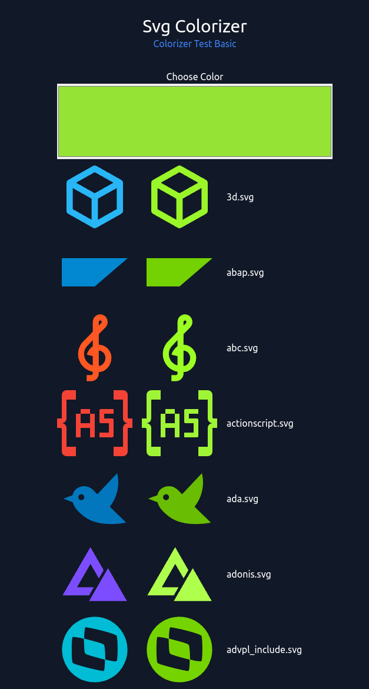

# SVG Colorizer POC [App](https://deniszholob.github.io/svg-colorizer-poc/)

Proof of concept app: Given an svg and a hex color, colorizes the svg to be that color

## Deployments 

- Master branch is for the source code that's hosted on
  [GhPages](https://deniszholob.github.io/svg-colorizer-poc/)

# Support Me

If you find the cheat sheet or the source code useful, consider:

- Donating Ko-fi: https://ko-fi.com/deniszholob
- Supporting on Patreon: https://www.patreon.com/deniszholob

# Screenshots

